<p align="center">
  
</p>

<p align="center">
  
  
  
  
</p>

---

A **weekly-verified** reference [skill](https://platform.claude.com/docs/en/agents-and-tools/agent-skills/overview) for the Claude Code tooling ecosystem — what tools exist, what each layer does, how they compose, and which ones to skip. Every non-obvious claim carries a confidence tag (`[VERIFIED]`, `[REPORTED]`, `[VENDOR]`, `[DISPUTED]`) and a source. The reference files are structured, not prose — meant to be read by a model, not a marketing team.

## Install

```bash
git clone https://github.com/Claude-Booster/claude-code-ecosystem \
  ~/.claude/skills/claude-code-ecosystem
```

Claude Code auto-discovers skills in `~/.claude/skills/`. Once cloned, the skill loads on description match — no further configuration.

To invoke it explicitly in a session:

```
/claude-code-ecosystem what MCP servers should I add?
```

## What's inside

Eight reference files, each with `last_verified` and `verify_horizon_days` front matter. When a file is past its horizon, treat `[VOLATILE]` claims as unverified until the next refresh run.

| File | Covers |
|---|---|
| [`core-surfaces.md`](references/core-surfaces.md) | CLI, models, pricing, IDE integrations, GitHub Actions, Bedrock / Vertex / Foundry |
| [`mcp-servers.md`](references/mcp-servers.md) | MCP server selection, registries, gateways, tool poisoning and injection attacks |
| [`skills-and-plugins.md`](references/skills-and-plugins.md) | Skills ecosystem, authoring conventions, plugins, marketplaces |
| [`orchestration.md`](references/orchestration.md) | Spec-driven dev, multi-agent frameworks, worktree managers, session control planes |
| [`context-and-cost.md`](references/context-and-cost.md) | CLAUDE.md conventions, AGENTS.md, memory tools, usage monitors, rate limits |
| [`gates-and-observability.md`](references/gates-and-observability.md) | Hooks as enforcement, OpenTelemetry, AI code review tool selection |
| [`landscape.md`](references/landscape.md) | Cursor, Codex CLI, Cline, Amp, Factory — architecture and current status |
| [`evidence-ledger.md`](references/evidence-ledger.md) | Known fabrications, disputed figures, verified primary sources |

## Routing

Read one file. Read a second only if the first genuinely doesn't answer the question.

| Question is about | Read |
|---|---|
| CLI primitives · models · pricing · IDE · GitHub Actions | `core-surfaces` |
| MCP server selection · registries · gateways · MCP security | `mcp-servers` |
| Skills · plugins · marketplaces · authoring conventions | `skills-and-plugins` |
| Multi-agent · spec-driven dev · frameworks · worktrees | `orchestration` |
| CLAUDE.md · memory · usage monitors · rate limits · spend | `context-and-cost` |
| Hooks · OpenTelemetry · AI code review tools | `gates-and-observability` |
| Cursor · Codex CLI · Cline · Amp · other CLIs | `landscape` |
| Whether a specific number or claim is trustworthy | `evidence-ledger` |

## Staying current

```bash
# Check which reference files are past their verify window (offline, no API cost)
python3 scripts/check_refs.py

# Run a headless refresh (writes patches to updates/YYYY-MM-DD/)
./scripts/refresh.sh
```

`refresh.sh` never edits `references/` directly — it emits review patches. A human merges what they accept and bumps `last_verified` in the file's front matter. Forgetting that bump is the failure mode that silently stops the loop. The GitHub Actions workflow runs this on a Monday schedule.

## Security note

This repo ships [`.claude/settings.json`](.claude/settings.json) with a `Bash(./scripts/refresh.sh*)` allow rule so the refresh script runs without a prompt. Review it before trusting project-level Claude Code settings in any session — a repo's `.claude/settings.json` is a [known attack surface](https://cve.mitre.org/cgi-bin/cvename.cgi?name=CVE-2025-59536).

## License

MIT
